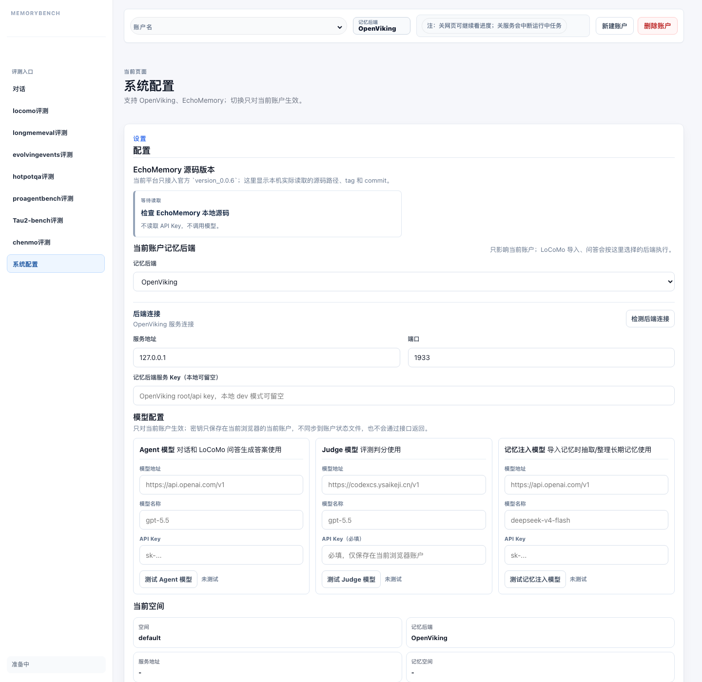
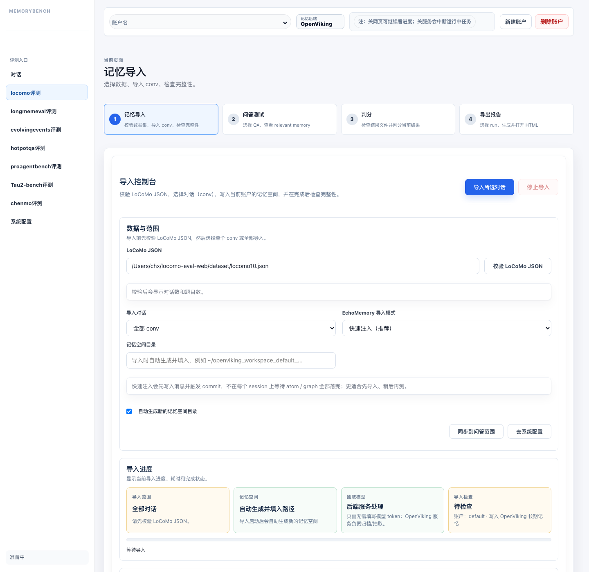
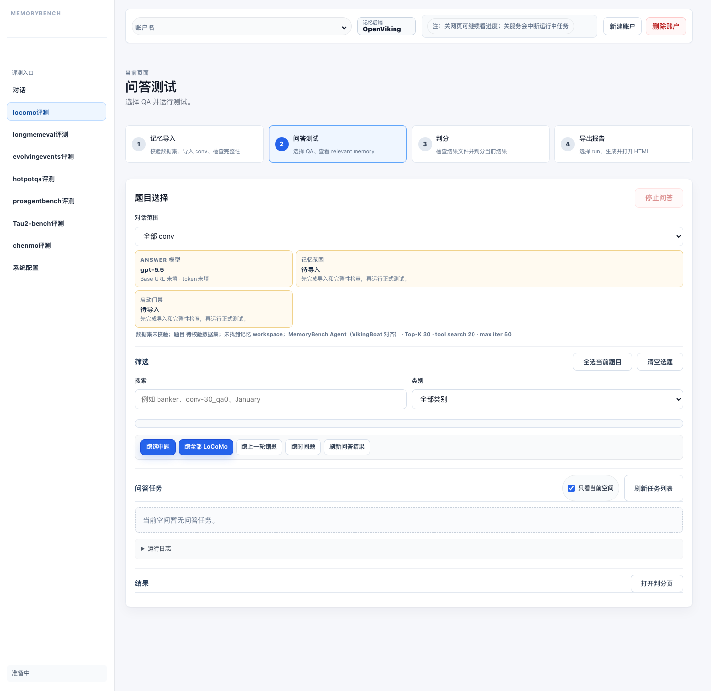
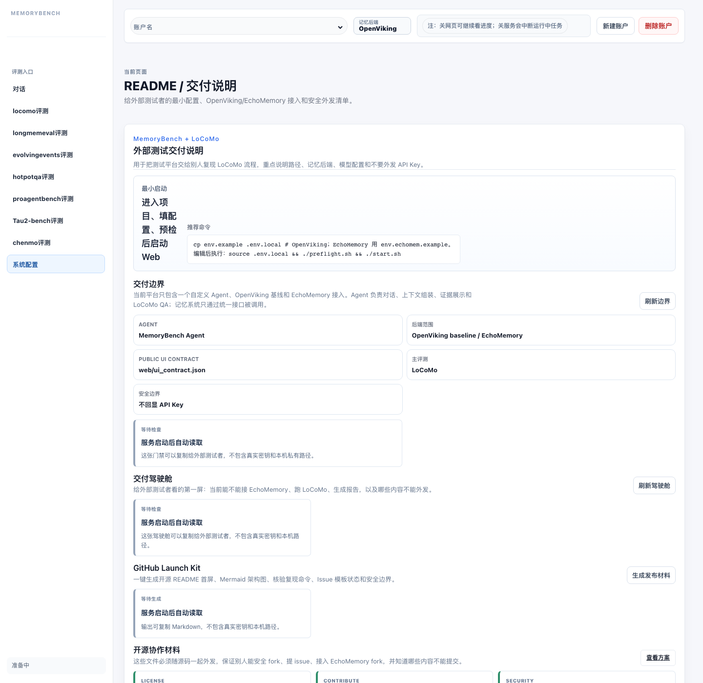

# EchoMemory 外部接入操作指南（带截图）

这份文档给外部测试者使用。目标是：拿到 `locomo-eval-web` 之后，把自己的 EchoMemory 接进来，用仓库内置的 LoCoMo 默认路径跑通导入、问答、Judge 和报告导出。

如果你只需要总览版说明，先看 [../README_ECHOMEM_LOCOMO_HANDOFF.md](../README_ECHOMEM_LOCOMO_HANDOFF.md)。这份文档重点是“实际要改什么”和“页面上怎么点”。

## 1. 先说结论

外部接入 EchoMemory，通常**不需要改平台里的检索逻辑**。

也要先澄清一件事：**不是所有记忆后端都只是给一个服务端口就能接入。**

当前仓库里两条链路不同：

- `OpenViking`：偏 HTTP 服务型，对接重点是 `host/port`
- `EchoMemory`：当前按本地 SDK + 源码目录 + workspace 对接，不要求单独起一个统一检索服务端口

所以，对接 EchoMemory 的关键不是“再给 Web 一个新端口”，而是让平台能稳定调用 EchoMemory 的导入和检索接口。

原因很简单：

- LoCoMo 导入由 `scripts/echomemory_locomo_import.py` 发起
- QA 检索由 `scripts/echomemory_memory_qa.py` 发起
- 这两条链路通过 `scripts/echomemory_common.py` 调 EchoMemory SDK
- Web 只负责组装任务参数，入口在 `memory/plugins/echomemory/tasks.py`

也就是说，EchoMemory 内部是不是图结构、是不是图加向量混合召回、是不是先 `find` 再 `search`，都留在 EchoMemory 自己内部实现。评测平台只要求 EchoMemory 最终能提供：

- 写入会话：`create_session`、`add_message`、`commit_session`
- 检索记忆：`find`、`search`
- 返回 evidence：至少能给出 `content`，以及 `uri/source_uri`、`score/confidence` 这一类基础字段

只有在下面两种情况，你才需要改平台代码：

1. 你的 EchoMemory fork 改了 SDK 路径、方法名或启动方式
2. 你的检索返回结构和平台当前 evidence 映射不兼容

这种情况下，通常只需要看这两个地方：

- `scripts/echomemory_common.py`
- `memory/plugins/echomemory/tasks.py`

## 2. LoCoMo 默认数据路径

这次交付已经把 LoCoMo 默认路径收敛好了。优先级是：

1. 环境变量 `LOCOMO_DATA`
2. `dataset/full/locomo.json`
3. `dataset/locomo.json`
4. `dataset/locomo10.json`

建议外部测试者这样放数据：

- 全量 LoCoMo：放到 `dataset/full/locomo.json`
- 只做 smoke test：直接用仓库自带的 `dataset/locomo10.json`

这样 Web 页面通常不用再手填路径。

## 3. 外部测试者最少需要准备什么

本机准备：

- Python 3.11+
- 一份可运行的 EchoMemory 源码目录
- EchoMemory 自己依赖的虚拟环境
- embedding 服务
- answer 模型服务
- judge 模型服务

仓库侧准备：

- 复制 `env.echomem.example` 为 `.env.local`
- 把 `ECHOMEM_ROOT` 指向本机 EchoMemory 源码
- 把 `ECHOMEM_WORKSPACE` 指向本机记忆空间目录
- 如果要默认跑全量 LoCoMo，把文件放到 `dataset/full/locomo.json`

最小示例：

```bash
cd <repo-root>
cp env.echomem.example .env.local
```

`.env.local` 至少要补这些值：

```bash
export LOCOMO_EVAL_HOST=127.0.0.1
export LOCOMO_EVAL_PORT=19181
export LOCOMO_DATA=dataset/locomo10.json

export ECHOMEM_ROOT=/absolute/path/to/echo_memory
export ECHOMEM_WORKSPACE=/absolute/path/to/echomem_workspace
export ECHOMEM_ACCOUNT=locomo_eval_account
export ECHOMEM_USER_ID=locomo_user
export ECHOMEM_AGENT_ID=locomo_agent

export DASHSCOPE_API_KEY=<embedding-api-key>
export DASHSCOPE_BASE_URL=https://<embedding-provider>/compatible-mode/v1

export ECHOMEM_CHAT_PROVIDER=deepseek
export ECHOMEM_CHAT_MODEL=gpt-5.5
export ECHOMEM_CHAT_API_KEY=<answer-api-key>
export ECHOMEM_CHAT_BASE_URL=https://<answer-provider>/compatible-mode/v1

export JUDGE_BASE_URL=https://<judge-provider>/v1
export JUDGE_MODEL=gpt-5.5
export JUDGE_TOKEN=<judge-api-key>
```

## 4. 启动平台

```bash
cd <repo-root>
source .env.local
./preflight.sh
./start.sh
```

浏览器打开：

```text
<WEB_BASE_URL>/
```

如果只是先看契约检查，也可以直接跑：

```bash
python3 scripts/adapter_doctor.py --format markdown --strict
curl -s <WEB_BASE_URL>/api/echomem-contract | python3 -m json.tool | head -160
```

## 5. 第一步：系统配置里切到 EchoMemory

进入左侧 `系统配置`。这里做三件事：

1. 切换当前账户的记忆后端到 `EchoMemory`
2. 检查 EchoMemory 源码版本和路径
3. 填好 Agent / Judge / 记忆注入模型配置

注意：下面截图里的顶部徽标可能显示的是拍图时账户上的当前后端，不影响你的实际操作；你应当以本机切换结果为准。



这里需要确认：

- `记忆后端` 已切到 `EchoMemory`
- EchoMemory 根目录能被识别
- 当前账户的 workspace / account / user / agent 是你本机准备的值
- Agent、Judge、记忆注入模型至少通过最基本连通性测试

如果你用的是自己的 EchoMemory fork，但这里只要平台能识别源码版本并且契约检查通过，就不需要继续改 Web。

## 6. 第二步：校验数据并导入 conv-30

进入左侧 `locomo评测`，先停在 `记忆导入` 这一步。



推荐按这个顺序：

1. 确认 `LoCoMo JSON` 指向默认路径
2. 点击 `校验 LoCoMo JSON`
3. `导入对话` 先选 `conv-30`
4. `EchoMemory 导入模式` 先用 `快速注入（推荐）`
5. 勾选自动生成新的记忆空间目录，避免污染旧 workspace
6. 点击 `导入所选对话`

导入完成后，重点看这些结果：

- `expected_messages` 和 `submitted_messages` 一致
- session 已创建
- `commit_session` 已执行
- 完整性状态是 `complete` 或至少没有缺消息

如果全量 LoCoMo 已经放在 `dataset/full/locomo.json`，页面通常会优先使用它；如果没有，就会回退到 `dataset/locomo10.json`。

## 7. 第三步：跑少量 QA，再跑 Judge

导入完成后切到 `问答测试`。



推荐先做小样本：

1. 对话范围选 `conv-30`
2. 先挑 5 到 10 道题
3. 运行问答
4. 确认每题都能产出 answer、context、relevant memory
5. 再运行 Judge
6. 最后导出 HTML 报告

如果你要快速 smoke test，建议优先看三件事：

- 检索条目是否真的来自 `conv-30`
- answer 模型是否正常返回
- Judge 是否能写回 `CORRECT/WRONG`

## 8. 平台内置 README 入口

页面里还有一个内置的 `README / 交付说明` 视图，适合给外部同学快速确认交付边界。



它适合做入口，但真正要接 EchoMemory，还是以本文档和 `README_ECHOMEM_LOCOMO_HANDOFF.md` 为准。

## 9. 哪些地方是 EchoMemory 自己实现，平台不管

这是外部接入里最容易问错的一点。

平台**不关心**：

- 图结构怎么建
- graph memory 怎么组织
- 向量索引怎么切分
- `find` 和 `search` 内部怎么路由
- 是图召回、向量召回还是混合召回

这些逻辑都应该待在 EchoMemory 内部。

平台只关心最终是否能：

- 导入消息
- commit 会话
- 给出可用于 answer 的相关记忆
- 把 evidence 写进结果和报告

所以外部接入者不需要为不同后端再写一套前端检索界面。后端差异应该收敛在适配层里。

## 10. 真要改代码，通常改哪几处

如果外部团队的 EchoMemory fork 和当前默认对接方式不一致，优先看这里：

### `scripts/echomemory_common.py`

适合改：

- EchoMemory 根目录识别
- `open_runtime` 导入路径
- `EchoMemSDK` 导入路径
- `ctx` / `search` / `find` 参数兼容
- evidence 字段映射

### `memory/plugins/echomemory/tasks.py`

适合改：

- EchoMemory Python 解释器位置
- CLI 参数拼装
- 默认 `top-k`、`score-threshold`
- `vikingboat_compat` 相关测试参数

### `env.echomem.example`

适合改：

- 如果你的 fork 改了环境变量名
- 如果你的服务端地址或模型入口和当前模板不一致

大多数情况下，不需要改：

- `server.py` 的检索逻辑
- LoCoMo 页面结构
- Judge 页面
- 报告导出逻辑

## 11. EchoMemory 最低接口契约

要让平台不用为你单独写检索分支，EchoMemory 至少应保持这些外部能力：

```python
from echomem.runtime.runtime import open_runtime
from echomem.protocol.local_sdk.sdk import EchoMemSDK

await sdk.create_session(...)
await sdk.add_message(...)
await sdk.commit_session(...)
await sdk.find(query, ctx=...)
await sdk.search(query, ctx=..., budget={"max_results": top_k})
```

检索返回建议至少带这些字段：

- `content`
- `source_uri` 或 `uri`
- `memory_type`
- `confidence` 或 `score`
- `evidence_uri`
- `trace`

平台不会强制你暴露图结构本身，但最终 evidence 不完整，HTML 报告和问答追踪就会缺信息。

## 12. 常见失败点

### 页面里明明能切后端，但 QA 一直不跑

通常是：

- 没有先导入
- workspace 没同步到当前账户
- 完整性检查没过
- answer 模型地址或 token 没配好

### EchoMemory 已有图结构，为什么平台还要关心 `find/search`

因为平台只看“检索接口输出”，不会直接读你的图存储。图结构只是 EchoMemory 的内部实现，不是 Web 平台的公共协议。

### 为什么我放了数据，页面还是默认 `locomo10.json`

说明 `dataset/full/locomo.json` 还不存在，或者你显式设置了 `LOCOMO_DATA` 指向别的文件。

## 13. 给外部测试者的一页版清单

1. 把完整 LoCoMo 放到 `dataset/full/locomo.json`，或者直接用 `dataset/locomo10.json`
2. 复制 `env.echomem.example` 到 `.env.local`
3. 填 `ECHOMEM_ROOT`、workspace、account、user、agent、模型地址和 token
4. 跑 `./preflight.sh`
5. 跑 `./start.sh`
6. 打开 `系统配置`，把后端切到 `EchoMemory`
7. 先导入 `conv-30`
8. 先测 5 到 10 题
9. 再跑 Judge
10. 导出 HTML 报告

如果这 10 步都能走通，说明外部团队已经能按当前平台契约接入 EchoMemory。
